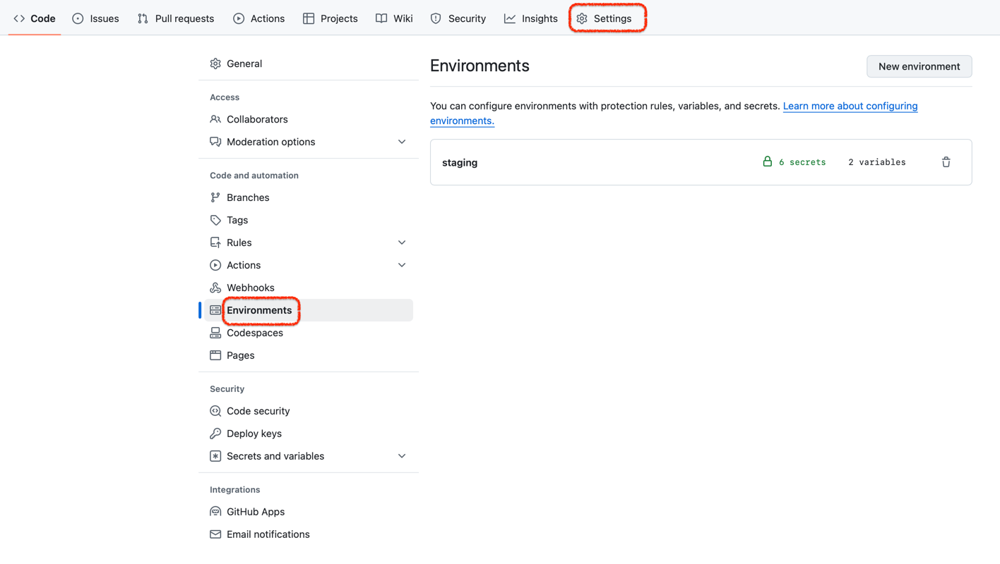
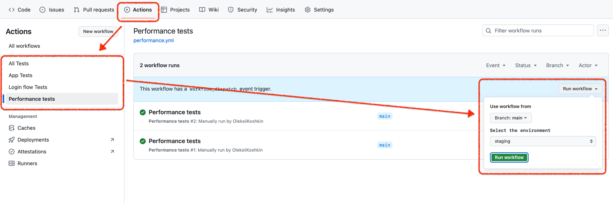

# Fintastic e2e: CI/CD environments

To run e2e on GitHub repository you need to prepare one or
more [environments](https://docs.github.com/en/actions/managing-workflow-runs-and-deployments/managing-deployments/managing-environments-for-deployment) to specify test user(s) and configuration database.

Open you repository and go to settings page/environments:



Each environment must include at least two secrets: `TEST_USER`, `TEST_USER_PASSWORD`

Additional secrets are database connection parameters:

```dotenv
DB_NAME=
DB_USER=
DB_PASSWORD=
DB_HOST=
DB_PORT= # optional, default is 5432
DB_SCHEMA=
```

If nothing configured, CI/CD will use [default local config](./run-config.md)

After that, you will be able to [run the flow](ci-cd-run.md).



Choose one of a projects, then branch (optional) and environment, and click 'Run workflow'.