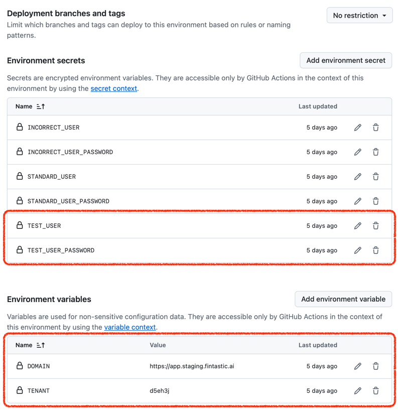

# Fintastic e2e: CI/CD environments

To run e2e on GitHub repository you need to prepare one or
more [environments](https://docs.github.com/en/actions/managing-workflow-runs-and-deployments/managing-deployments/managing-environments-for-deployment).

Open you repository and go to settings page/environments:

Each environment must include two value and at least two secrets:

Variables: `DOMAIN`, `TENANT`

Secrets: `TEST_USER`, `TEST_USER_PASSWORD`

Optional secrets (for detailed login flow
tests): `INCORRECT_USER`, `INCORRECT_USER_PASSWORD`, `STANDARD_USER`, `STANDARD_USER_PASSWORD`

After that, you will be able to select one of the flows on desired environment:

Choose one of a projects, then branch (optional) and environment, and click 'Run workflow'.