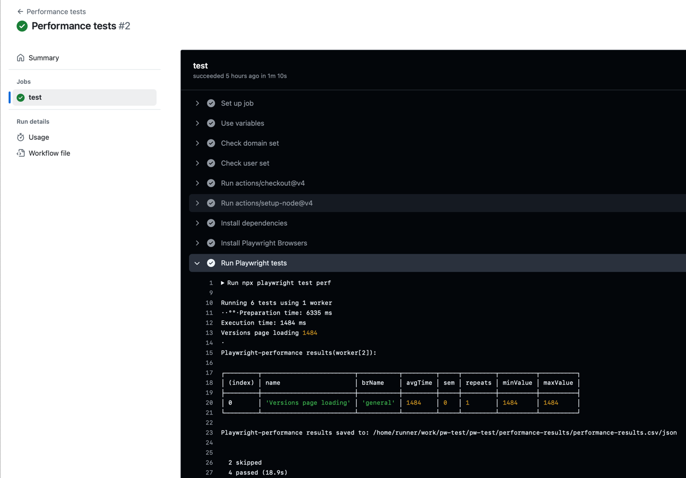
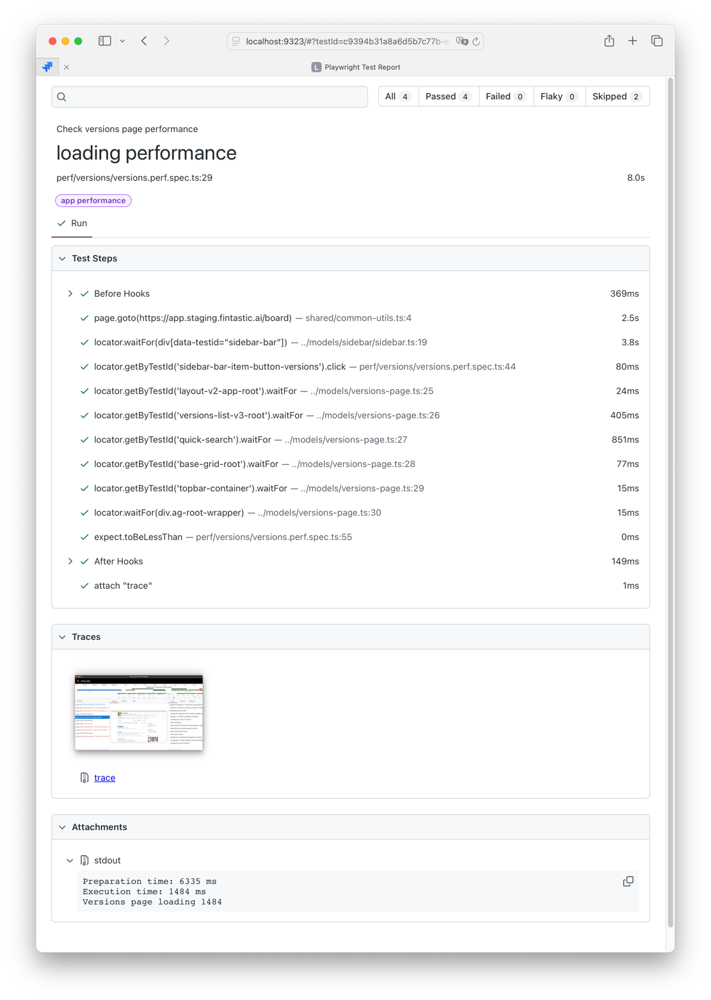
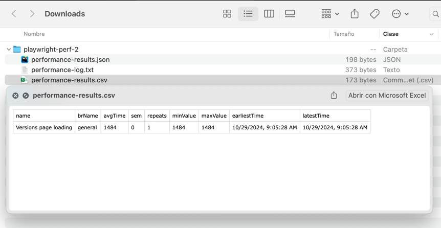

# Fintastic e2e: accessing CI/CD test results for performance tests

To get results of performance tests, you usually need to access the same results as for regular tests:



Or download `playwright-report.zip`, unpack it and run

```shell
npx playwright show-report ~/Downloads/playwright-report
```



Or download `playwright-perf.zip` artifact and analyze raw data (JSON, text and .csv formats available):



But this usually ha very little sense because test runner keeps data only for single run (except you'll run test
multiple times in a single suite).

The standard approach here is to run the performance tests locally several times to collect average data in
the `performance-results` folder, and then use these values in `expect` evaluations.