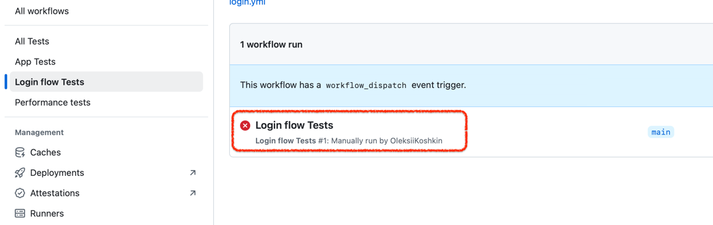
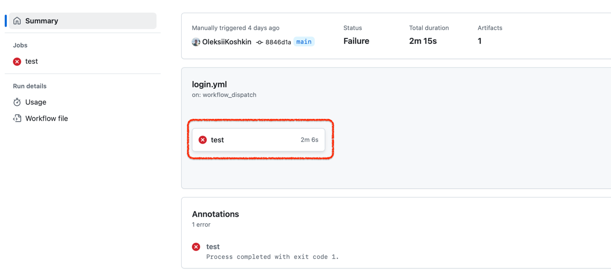
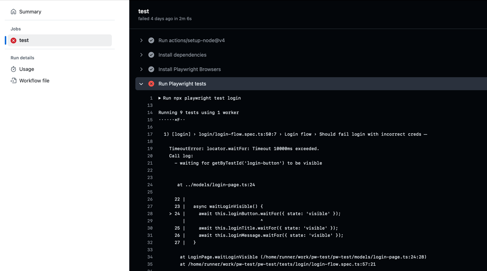
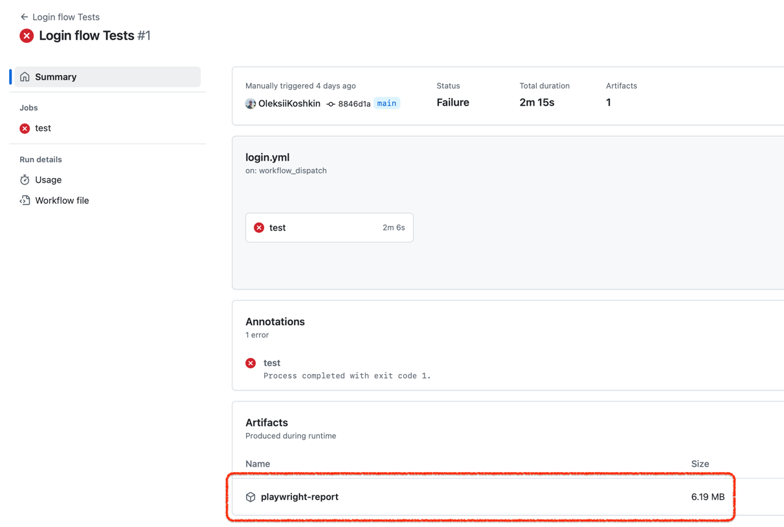
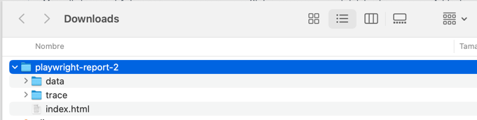
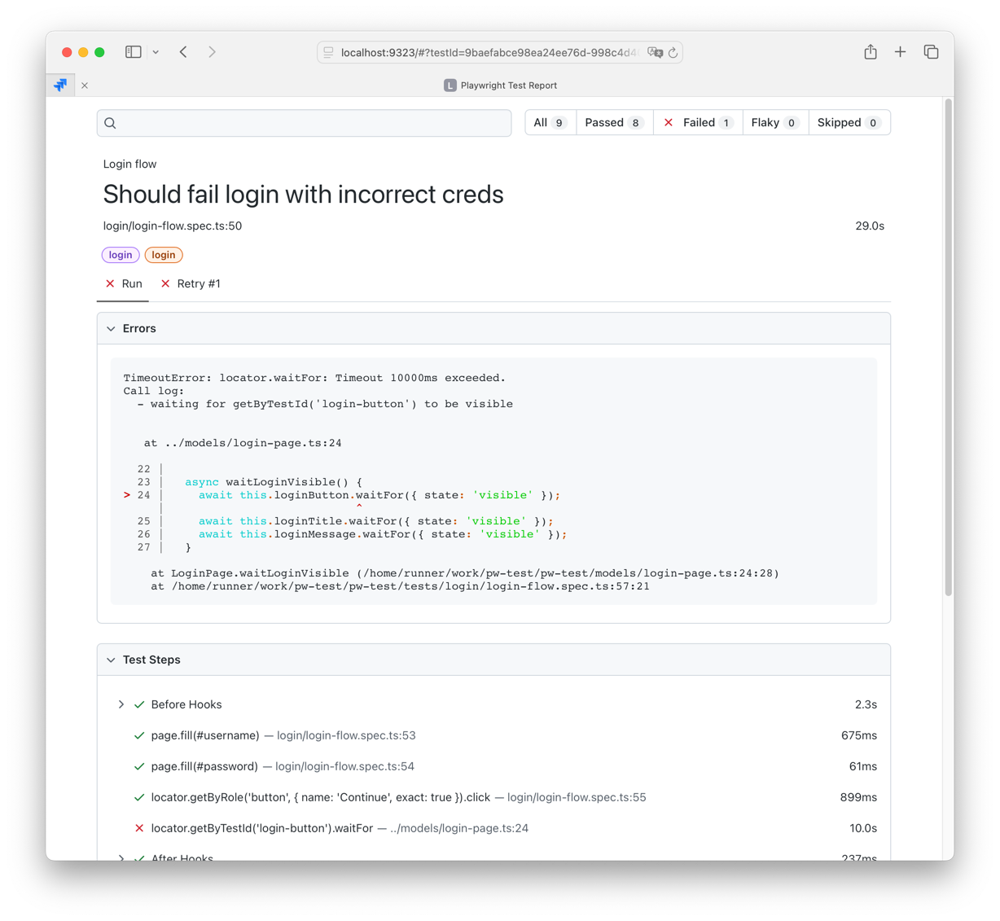

# Fintastic e2e: accessing CI/CD test results

### GitHub Console

There are several ways to reach the test results. First, just reading the console:



which displays text console:



next,



You can download log or view raw data. Not too user-friendly but fast and effective.

### Local Playwright trace player

Also, you can download the test artifacts:



Then, extract archive:



and run player in a console:

```shell
npx playwright show-report ~/Downloads/playwright-report-2
```

and it will open in the browser:


So you need to execute

```shell
npx playwright show-report %path_to_a_folder_with_downloaded_report%
```

(if Playwright is not installed please install it)

Read more: [Trace viewer](https://playwright.dev/docs/trace-viewer).

### Online player

You can use [Playwright's online player](https://trace.playwright.dev/)

