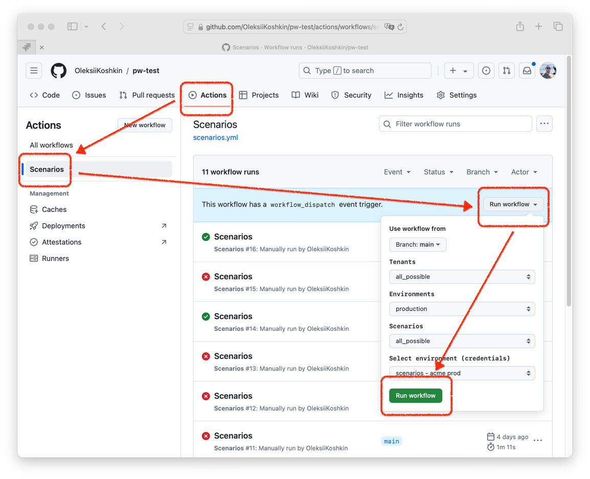

# Fintastic e2e: CI/CD Run

To run e2e on GitHub repository you need to [prepare it](ci-cd-environments.md)

After that, you will be able to select one of the flows on desired environment:

Choose one of a test projects, then branch (optional) and environment, and click 'Run workflow'.

It will take some time and then resolve in a state of success (green) or failure (red).

You can click on particular result to see the details:

[This page](ci-cd-results.md) includes detailed description how to work with GitHub CI/CD results. 
