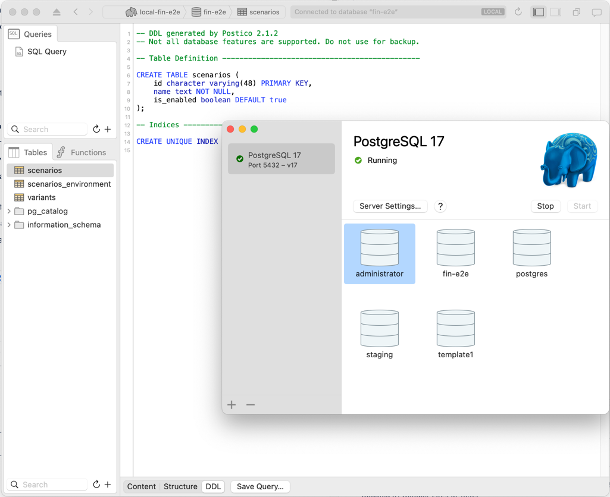
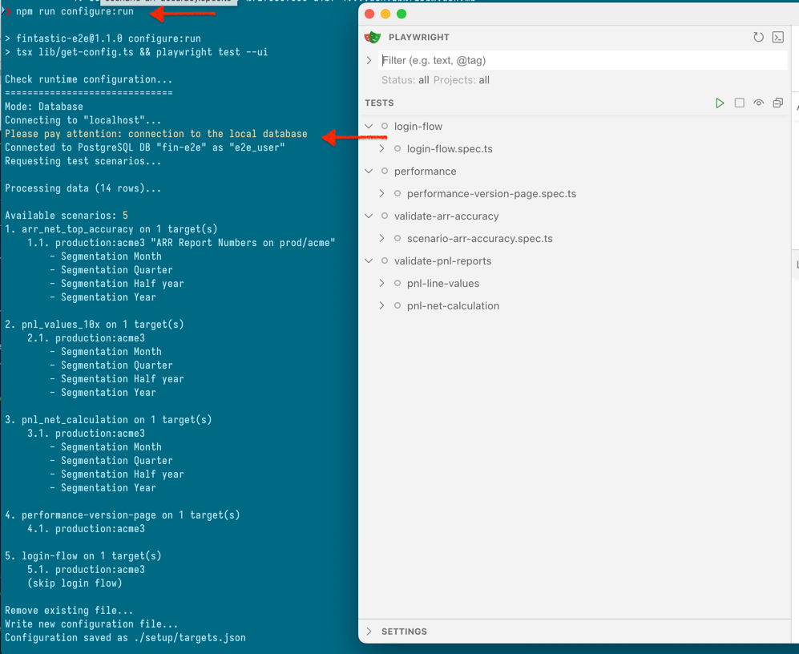
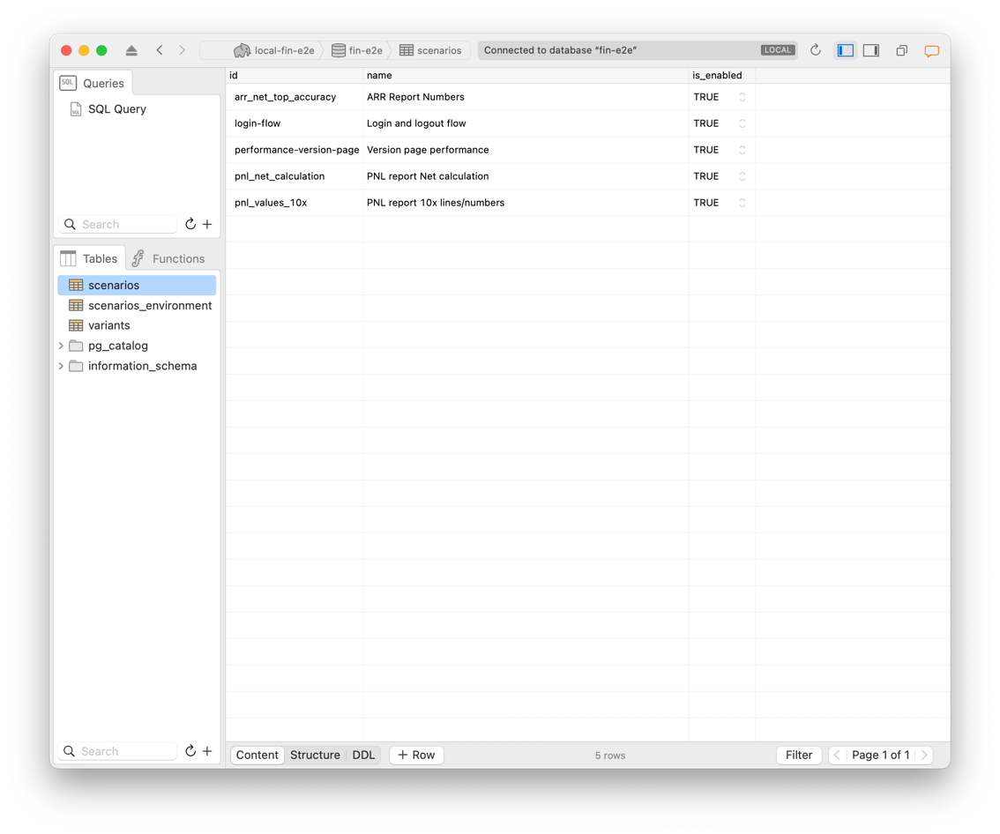

# Fintastic e2e: Configurations database

The available [configurations](./run-config.md) are stored in the local or remote PostgreSQL database.

To set up local database I recommend install Postgres with Postgres app and Postico2 
as a management tool on macOS:

* https://postgresapp.com/
* https://eggerapps.at/postico2/



First one allows to have local PostgreSQL without installation, the second one is simple and convenient
DB client.

## DB user and role

```sql
CREATE ROLE e2e_user2 WITH
LOGIN
NOSUPERUSER
NOCREATEDB
NOCREATEROLE
INHERIT
NOREPLICATION
NOBYPASSRLS
CONNECTION LIMIT -1;

GRANT ALL PRIVILEGES ON ALL TABLES IN SCHEMA public TO e2e_user;
GRANT ALL PRIVILEGES ON ALL SEQUENCES IN SCHEMA public TO e2e_user;
```

## Tables

Then we need 3 tables that will hold the [configuration](./run-config.md) data

### Scenarios table

```sql
CREATE TABLE scenarios (
id character varying(48) PRIMARY KEY,
name text NOT NULL,
is_enabled boolean DEFAULT true
);

CREATE UNIQUE INDEX e2e_scenarios_pkey ON scenarios(id text_ops);
```

### Targets (environments)
```sql

CREATE TABLE scenarios_environment (
id integer GENERATED ALWAYS AS IDENTITY PRIMARY KEY,
scenario_id character varying(48) REFERENCES scenarios(id) ON DELETE CASCADE ON UPDATE CASCADE,
is_enabled boolean DEFAULT true,
tenant_id character varying(16) NOT NULL,
environment character varying(48) NOT NULL,
initial_url text,
widget_id text,
description text,
skip_login boolean DEFAULT false
);

CREATE UNIQUE INDEX e2e_targets_pkey ON scenarios_environment(id int4_ops);
```

### Variants

```sql
CREATE TABLE variants (
id integer GENERATED ALWAYS AS IDENTITY PRIMARY KEY,
scenarios_environment_id integer REFERENCES scenarios_environment(id) ON DELETE CASCADE ON UPDATE CASCADE,
is_enabled boolean DEFAULT true,
name text NOT NULL,
url_params text
);

CREATE UNIQUE INDEX e2e_variants_pkey ON variants(id int4_ops);
```

### Test query

```sql
select
e2e_scenarios.scenario_id,
e2e_scenarios.scenario_name,
e2e_targets.target_id,
e2e_targets.target_name,
e2e_targets.tenant,
e2e_targets.environment,
e2e_targets.target_url,
e2e_targets.widget_id,
e2e_variants.variant_id,
e2e_variants.variant_name,
e2e_variants.variant_url_params
from e2e_scenarios
left join e2e_targets on e2e_targets.scenario_id=e2e_scenarios.scenario_id
left join e2e_variants on e2e_variants.target_id=e2e_targets.target_id
where
scenario_enabled=true
and target_enabled=true
and (variant_enabled=true OR variant_enabled is null);
```

## `.Env` file

Then you need to configure environment file with connection params:

```dotenv
DB_NAME=
DB_USER=
DB_PASSWORD=
DB_PORT=
```

Then you can run [configuration script](./run-config.md):


```shell
npm run configure:run
```



Of course, you need to fill the tables with existing scenarios and targets (environments):


