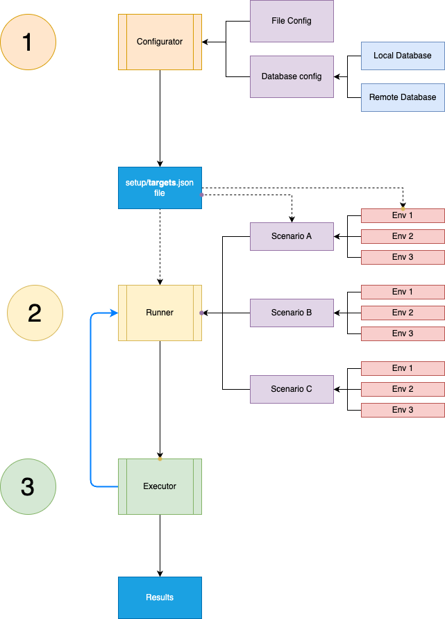

# Fintastic e2e: overall structure

There are three parts:
1. [Configurator](./run-config.md).
2. [Scenarios player](./scenarios-player.md) - runner.
3. Test [executor](./scenarios.md).




First one is entry point.

```shell
npm run configure
```

Will connect to database or use default template to prepare actual targets `setup/tartgets.json`

```shell
npm run configure:run
```

Will prepare targets and run [scenarios player](./scenarios-player.md) in UI mode.

```shell
npm run configure:run:headless
```

Will do the same but in console mode.