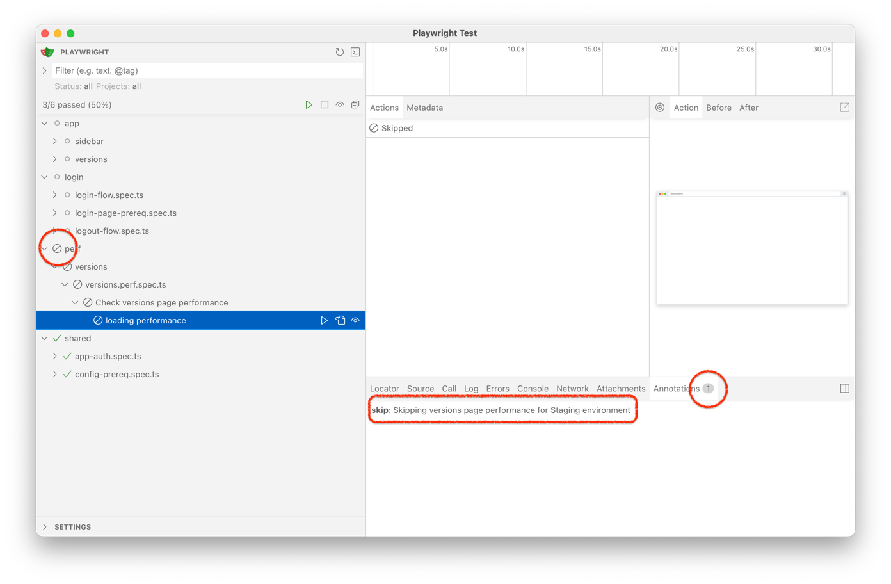

# Fintastic e2e: Environment-dependent testing

## Conditional tests

Sometimes different logic is required to work in different environments. E2e framework includes very simple structure
you can use to handle that:

```ts
// tests/shared/common-utils.ts
export const whichEnvironment = {
  isProd: testTarget.baseUrl.includes('app.fintastic.ai'),
  isStaging: testTarget.baseUrl.includes('app.staging.fintastic.ai'),
  isDev: testTarget.baseUrl.includes('development.fintastic.ai'),
  isLocal: testTarget.baseUrl.includes('localhost:3000')
};
```

And use it in the particular test suite with `test.skip`, e.g.,

```ts
test.describe('Check versions page performance', async () => {
  test.skip(whichEnvironment.isStaging, 
    'Skipping versions page performance for Staging environment');
 // ...
```



* [Read more](https://playwright.dev/docs/test-annotations#skip-a-test) about `test.skip`
* Read more about [soft assertions](https://playwright.dev/docs/test-assertions#soft-assertions).

## Conditional projects

You can skip entire project as well:

```ts
// projects/app-perf.ts
export const appPerfProject: ProjectConfig[] = whichEnvironment.isStaging // <-- 
  ? [] 
  : [
      {
        name: 'app performance',
        testMatch: 'perf/**/*.spec.ts',
        dependencies: checkSkipAuth() ? [] : ['app auth']
      }
    ];
```
