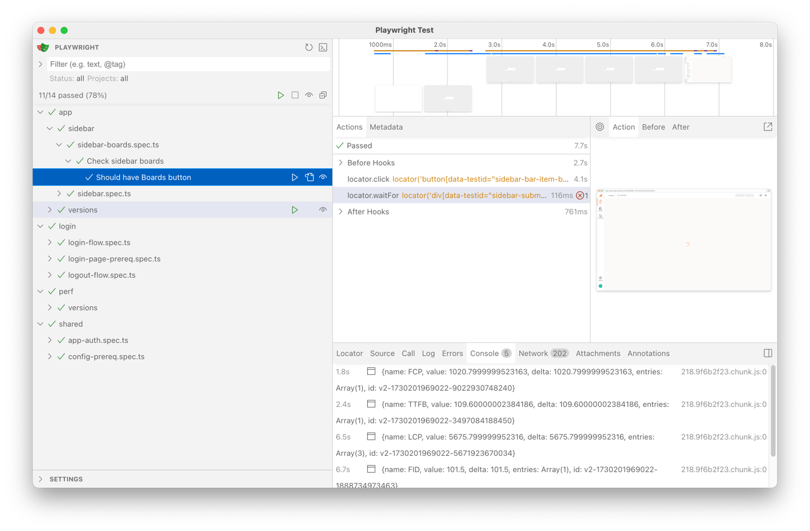
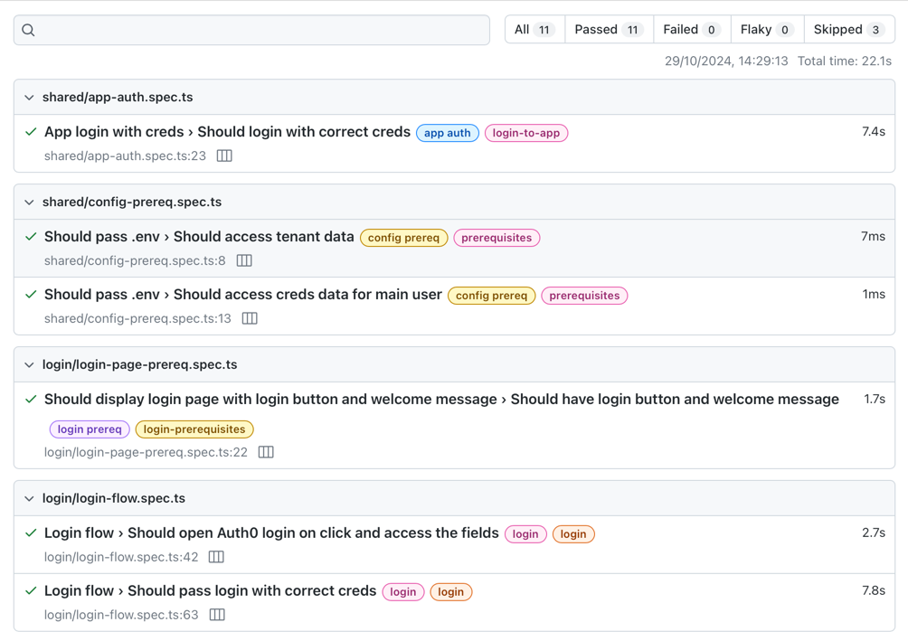

# Fintastic e2e: How to Use Locally

1. Clone repository
2. Install dependencies: `npm install`
3. Create `.env` file using `.env-template`:

```dotenv
TEST_USER=auto_test@fintastic.ai # login for correct user to run tests
TEST_USER_PASSWORD=

# optional
DB_NAME=
DB_USER=
DB_PASSWORD=
DB_PORT=
```

Note: `DB_NAME` and all the `DB...` required for [local database config](./db-config.md).

4. Run tests with [Playwright UI](https://playwright.dev/docs/test-ui-mode) (do not forget to run local app for local
   environment):

```shell
npm run test
```



ALl the test suites are tagged, so you can select desired tests.

### Console run

To run tests in console use:

`npm run test:headless` or `npm run test:headed` (is not recommended if you don't know what you're doing)


To open last result run

```shell
npm run report
```



### Skip login

(See [Auth flow](./auth-flow.md) page for details)

To skip Login (auth) step on each run for local testing use `SKIP_AUTH=true` env variable:

```shell
SKIP_AUTH=true npm run test
```` 

(or other `npm run`s)

ONLY after the first run. The framework will save the authorisation data after the first run (`projects/app-auth.ts`)
and reuse it for all subsequent runs.
