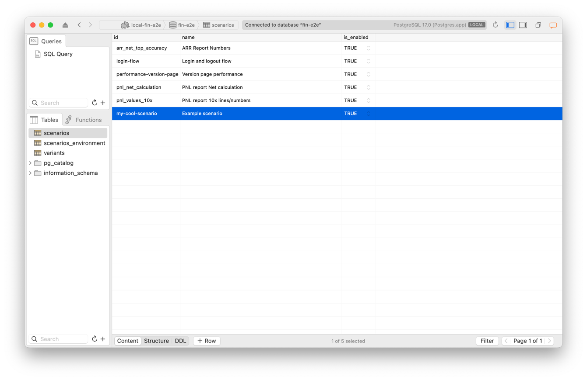
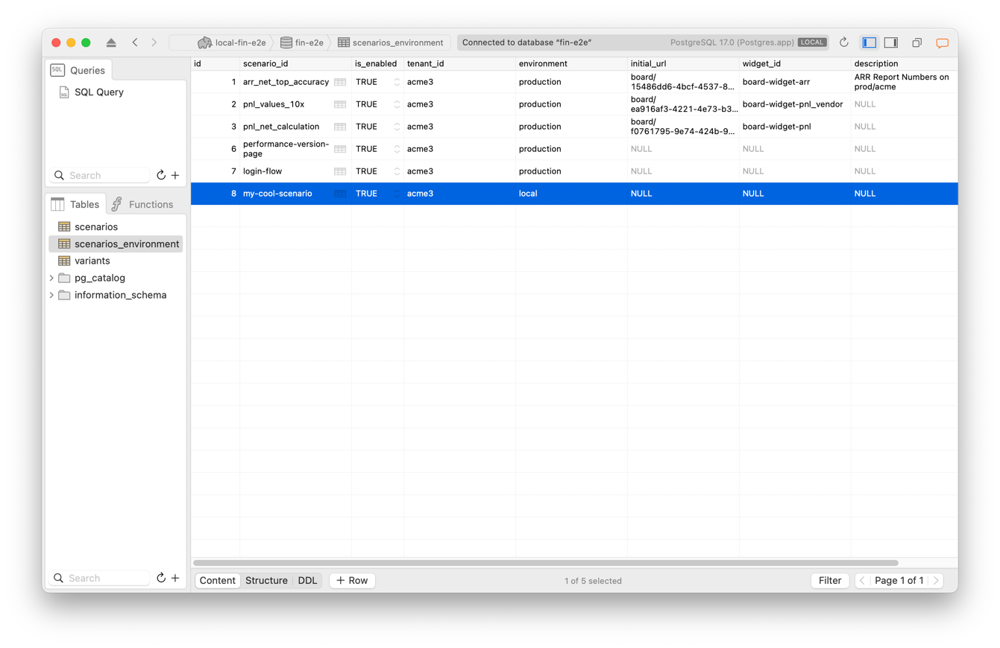
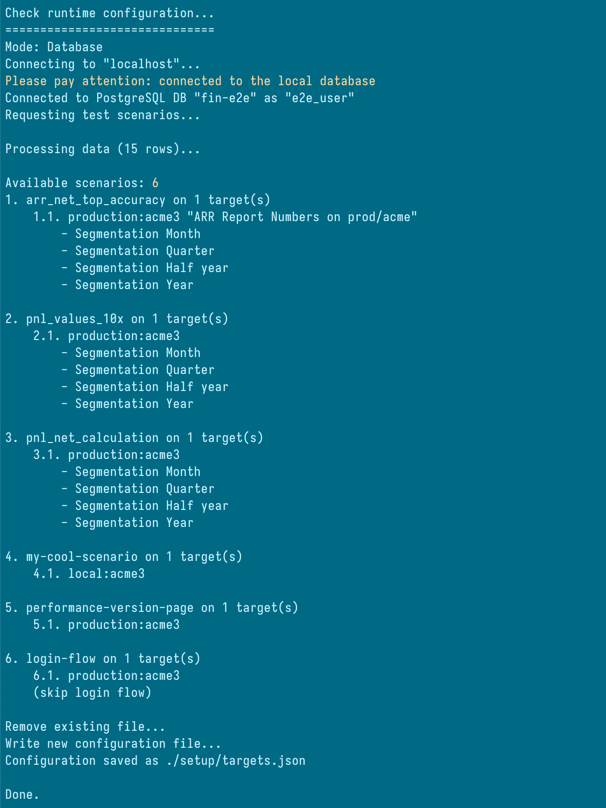
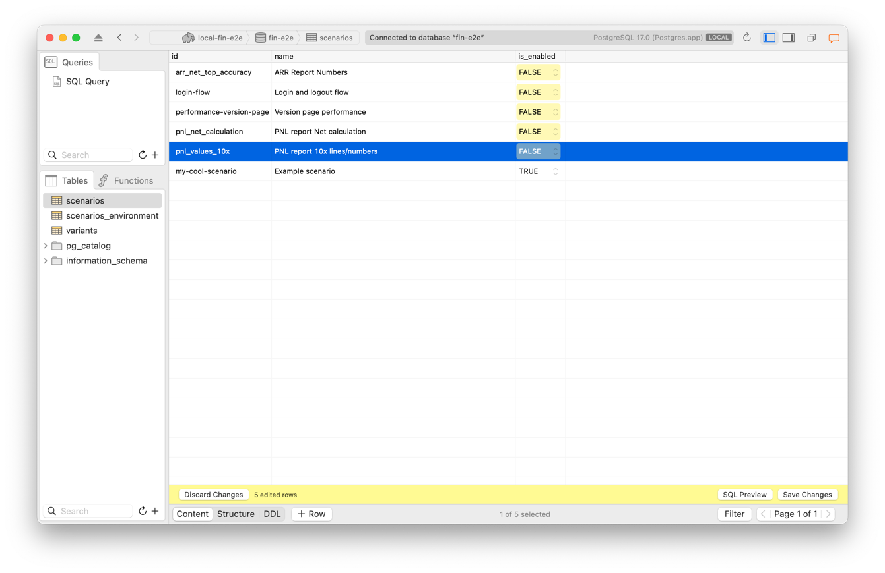
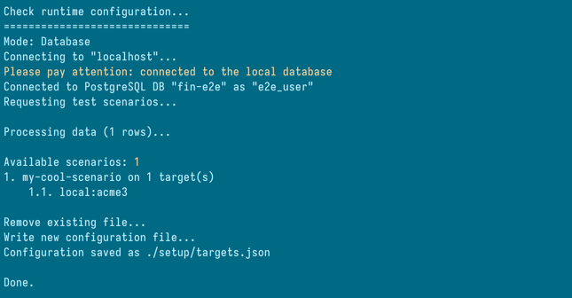
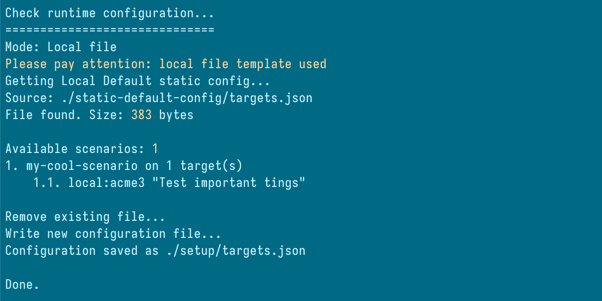
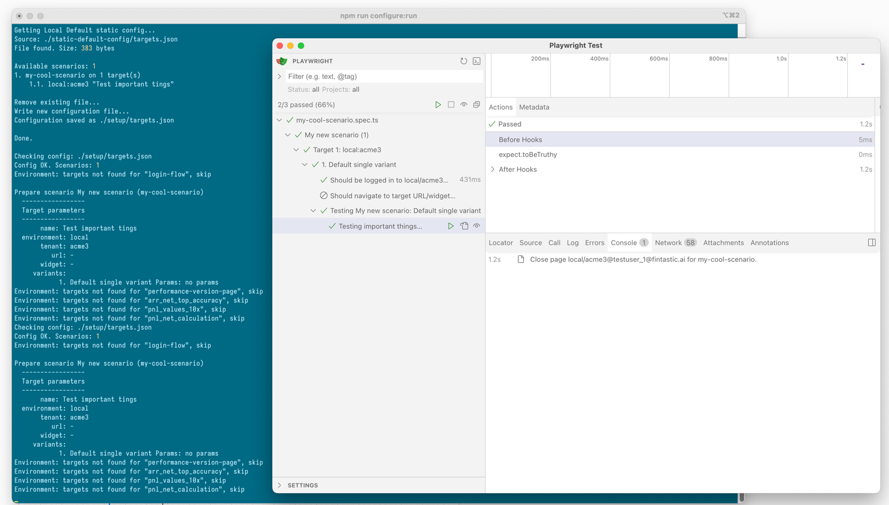

# Fintastic e2e: New scenario

To create new [scenario](./scenarios.md) you need to perform such steps:

1. Register new ScenarioId.
2. Write [local test configuration](./run-config.md).
3. Write code and test it locally using [branching policy](./branching.md).
4. Publish the code.
5. Update global configuration database.
6. Update CI/CD workflow.

## Scenario Id

`scenarioId` is the key which is used in configurations database:


Each scenario must have own uniq Id. Ids are listed in `types/environment.ts`:

```ts
export const knownScenarios = [
  'arr_net_top_accuracy',
  'pnl_values_10x',
  'pnl_net_calculation',
  'performance-version-page',
  'login-flow'
] as const;

export type KnownScenario = typeof knownScenarios[number];
```

Both configurator (`npm run configure`) and runner (`npm run test`) are using that to check validity of configuration.

So, you need to add a line here:

```ts
export const knownScenarios = [
  'arr_net_top_accuracy',
  'pnl_values_10x',
  'pnl_net_calculation',
  'performance-version-page',
  'login-flow',
  'my-cool-scenario'
] as const;
```

## Preparing run configuration

There are some ways to configure scenario to run. 

### Local Database

You can use [local DB](./db-config.md). You need to configure `.env` file, then add record to `scenarios` table:



Then to `scenarios-environment`:



(let's suppose it should be run on localhost, acme3, no initial parameters, no target widget).

Then you can execute `npm run configure`:



Let's disable all other scenarios. Open `scenarios` table and set `is_enabled` to `FALSE`:



Commit, run `npm run configure` one more time:



Ok, only one scenario to run.

### Local default configuration

If you don't want to use local database, you can prepare `static-default-config/targets.json` manually.

Open file and fill it using `new-target.json` as a template:

```json
{
  "scenarios": [
    {
      "scenarioId": "my-cool-scenario",
      "name": "My new scenario",
      "targets": [
        {
          "id": 1,
          "name": "Test important tings",
          "tenant": "acme3",
          "domain": "local",
          "skipLogin": false,
          "url": "",
          "targetWidgetId": "",
          "variants": []
        }
      ]
    }
  ]
}
```
Save `targets.json`.

Then remove database config from `.env` file, if it was configured before, and run `npm run configure`:



### Direct targets

You can just write `setup/targets.json` using the same JSON. In this case you don't need to run `npm run configure`
but just 

```shell
npm run test
```

to start [scenarios player](./scenarios-player.md) immediately. Please pay attention: content of `./setup` folder is 
under `.gtignore` so if you want to use a development branch - use one of the previous approaches.

Otherwise, it will only be available on the local computer.

## Preparing test scenario

If you run scenarios player with `npm run configure:run` or `npm run test` it will display empty list because 
scenario is not implemented yet.

So you need to go to `.scenarios` folder and create new folder `my-cool-scenario`, and two files:

* `my-cool-scenario.spec.ts` for registering scenario, and
* `my-cool-scenario-test-executor.ts` to implement the test logic.

`my-cool-scenario.spec.ts`:

```ts
import { scenarioPlayer } from '../../scenarios-player';
import { testMyCoolScenario } from './my-cool-scenario-test-executor';

scenarioPlayer({ scenarioId: 'my-cool-scenario', testExecutor: testMyCoolScenario });
```

`my-cool-scenario-test-executor.ts`:

```ts
import { expect, test } from '@playwright/test';
import { ScenarioRunContext } from '../../types';

export function testMyCoolScenario(params: ScenarioRunContext) {
  test('Testing important things', async () => {
    test.fail(!params.page, 'No Page to process!');

    expect(true).toBeTruthy();
  });
}
```

Now you can run the scenario:

```shell
npm run test
```



## Writing test suite

Then you need to implement the test suite code. Be creative.

Change `my-cool-scenario-test-executor.ts` according to requirements.

## Publishing

Let's suppose everything is fine, scenario works, passes tests on local/staging/prod environments.

Now you need to make it default.

1. Add config (scenarioId, environments, variants) to global Database.
2. Add option to `./github/workflows/scenarios.yml` if you haven't already done so in your branch:

```yaml
name: Scenarios

on:
  workflow_dispatch:
    inputs:
      #...
      run_scenarios:
        description: Scenarios
        type: choice
        default: 'all_possible'
        options:
          - all_possible
          - arr_net_top_accuracy
          - pnl_values_10x
          - pnl_net_calculation
          - performance-version-page
          - login-flow
          - my-cool-scenario  # <-- this one
      environment:
        type: environment
          # ...
```

3. Add entry to default template file `static-default-config/targets.json`. 
Do not forget to reset it first to previous (global) state if you've used local config and changed this file 
during development.

4. Merge.
