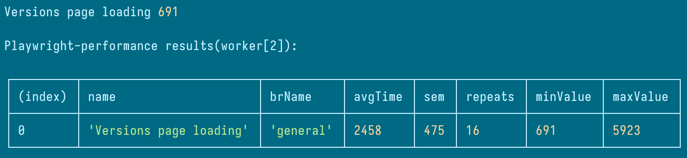

# Fintastic e2e: Performance testing

### Local run

To run only performance tests you can use

```shell
SKIP_AUTH=true npm run test perf
```

(or just

```shell
npm run test perf
```

if you don't want reuse login/not yet logged in - [read more](auth-flow.md))

or

```shell
SKIP_AUTH=true npm run test:headless perf
```

to see results in the console. Reports will be stored in `performance-results` folder.

### Structure

Performance testing is based on [plugin](https://www.npmjs.com/package/playwright-performance). This is example of test
suite:

```ts
import { expect, Page, test as base } from '@playwright/test';
import { navigateTo } from '../../shared/common-utils';
import type { PerformanceOptions, PerformanceWorker, PlaywrightPerformance } from 'playwright-performance';
import { playwrightPerformance } from 'playwright-performance';
import { VersionsPage } from '../../../models/versions-page';
import { Sidebar } from '../../../models/sidebar/sidebar';

const test = base.extend<PlaywrightPerformance, PerformanceOptions & PerformanceWorker>({
  performance: playwrightPerformance.performance,
  performanceOptions: [{}, { scope: 'worker' }],
  worker: [playwrightPerformance.worker, { scope: 'worker', auto: true }]
});

let page: Page;

test.beforeAll(async ({ browser }) => {
  page = await browser.newPage();
});

test.afterAll(async () => {
  await page.close();
});

test.describe('Check versions page performance', async ({ page, performance }) => {
  await navigateTo(page, 'board'); // should be 404
  const sidebar = new Sidebar(page);
  await sidebar.getSidebar();

  performance.sampleStart('Versions page loading');

  await sidebar.versionsButton.click();
  const versionsPage = new VersionsPage(page);
  await versionsPage.waitVersionPageVisibility();

  performance.sampleEnd('Versions page loading');

  console.log('Versions page loading', performance.getSampleTime('Versions page loading'));

  expect(performance.getSampleTime('Versions page loading')).toBeLessThan(3000); // <-- key point
});
```

If you run that in console, you can see a table like that:



The standard approach here is to run the performance tests locally several times to collect average data in
the `performance-results` folder, and then use these values in `expect` evaluations.