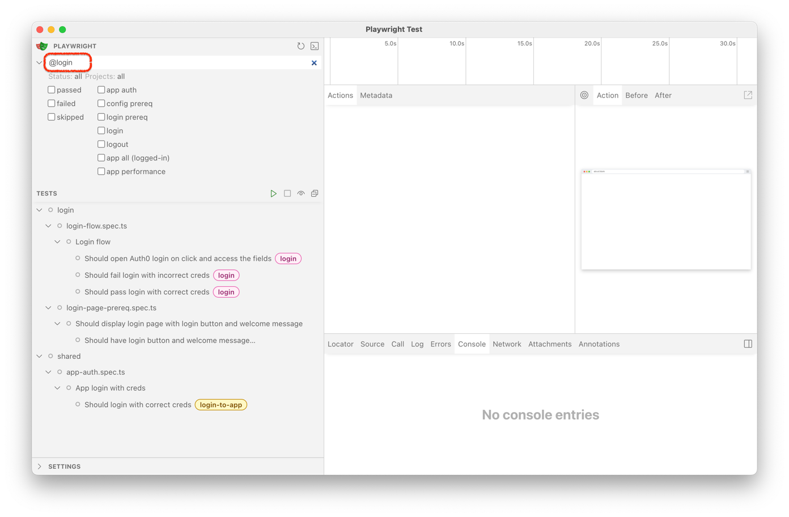
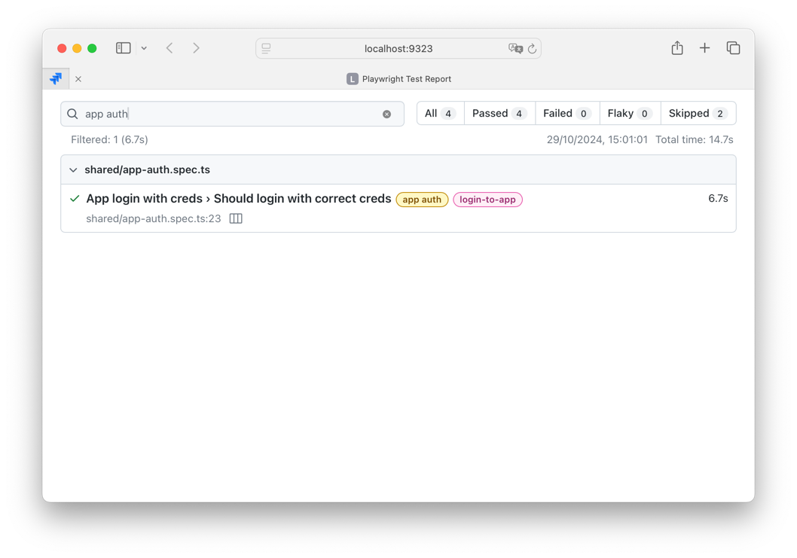

# Fintastic e2e: New project/Scenario

Reference: [Test projects](projects.md)

## Project types

Test suites (projects) can be:

- Feature-targeted (spot tests)
- Flow targeted (scenarios)

Both may include one or more tests (that's why they are called ‘test suites’), but their purposes are different.

First one usually shorter and tests specific features, like "Period selection component":

- it can be opened,
- allows to select year,
- disables second input if not a range selection,
- allows to select multiple months and displays labels correctly,
- etc.

The second is like:

1. Page - Board with ARR report
2. Time picker set show by=Month
3. Single version / multiple versions
4. Group is set as the first dim in pivot

Validate:

- Net value of every column equals to the start value of next column
- Repeat #5 for show by=Quarter, Half year, Year.

It means, scenarios test a _business flow_.

## Setting up new test project

When you are starting to implement new project, you need to create a project descriptor, add it to config and, then,
write tests.

### Project descriptor

Located in `projects` folder. First, modify `types.ts`:

```ts
export type ProjectNames = |
  'config prereq' |
  'login prereq' |
  'login' |
  'logout' |
  'app auth' |
  'app all (logged-in)' |
  'app performance'
```

Add a name of your suite here:

```ts
//... |
'my cool suite'
```

Second, create "descriptor" file:

```ts
// my-cool-suite.ts
import { ProjectConfig } from './types';
import { checkSkipAuth } from '../lib/preset';

export const myCoolSuiteProject: ProjectConfig[] = [
  {
    name: 'my cool suite',
    testMatch: 'my-cool-suite/**/*.spec.ts',
    dependencies: checkSkipAuth() ? [] : ['app auth']
  }
];
```

Pay attention:

- `testMatch` is a glob where your tests will be located. In this case it is `tests/my-cool-suite/*`, all the
  subfolders.
- `dependencies` describes what has to be executed before run your test suite. In this case it will be **optional
  ** `app auth`
  project (see [auth flow](auth-flow.md) for details)

Third, add to `projects/index.ts` unify export:

```ts
export * from './global-prereq'
export * from './login-flow'
// ..
export * from './my-cool-suite.ts' // <-- this line
```

### Global Config

Next, add your suite to `playwright.config.ts`:

```ts
  projects: [
  ...globalPrerequisitesProject,
  ...loginFlowProject,
  ...appAuthProject,
  ...appAllProject,
  ...appPerfProject,
  ...myCoolSuiteProject // <-- this line
]
```

### Test suite

Then you can create tests in `tests/my-cool-suite` folder.

Minimal test could be smth like that:

```ts
import { expect, Page, test } from '@playwright/test';
import { navigateTo } from '../../shared/common-utils';
import { VersionsPage } from '../../../models/versions-page';

let page: Page;

test.beforeAll(async ({ browser }) => {
  page = await browser.newPage();
});

test.afterAll(async () => {
  await page.close();
});

test('Should load versions page', async () => {
  await navigateTo(page, 'versions');

  const versionsPage = new VersionsPage(page);
  await versionsPage.waitVersionPageVisibility();

  const versionsCount = await versionsPage.agGridRows.count();
  expect(versionsCount).toBeGreaterThan(1);
});
```

#### Models

As you can see, there is `VersionsPage` [model](https://playwright.dev/docs/pom):

```ts
import { Page } from '@playwright/test';

export class VersionsPage {
  readonly pageContainer;
  readonly versionsList;
  readonly quickSearch;
  readonly gridRoot;
  readonly topBar;
  readonly agGridWrapper;
  readonly agGridRows;
  private page: Page;

  constructor(page: Page) {
    this.page = page;
    this.pageContainer = this.page.getByTestId('layout-v2-app-root');
    this.versionsList = this.page.getByTestId('versions-list-v3-root');
    this.quickSearch = this.page.getByTestId('quick-search');
    this.gridRoot = this.page.getByTestId('base-grid-root');
    this.topBar = this.page.getByTestId('topbar-container');
    this.agGridWrapper = this.page.locator('div.ag-root-wrapper');
    this.agGridRows = this.page.locator('div.ag-row');
  }

  async waitVersionPageVisibility() {
    await this.pageContainer.waitFor({ state: 'visible' });
    await this.versionsList.waitFor({ state: 'visible' });
    await this.quickSearch.waitFor({ state: 'visible' });
    await this.gridRoot.waitFor({ state: 'visible' });
    await this.topBar.waitFor({ state: 'visible' });
    await this.agGridWrapper.waitFor({ state: 'visible' });
  }
}
```

Pretty simple but very useful abstraction of target subsystem/page/feature/component you're going to test.

You need to add `data-testid` attributes to key nodes of your target application, and use them in the model and tests.

#### Tags

You can, and you should, use [tags](https://playwright.dev/docs/test-annotations#tag-tests) in your suites to make
navigation and running the test more simple and manageable:

```ts
test.describe('Login flow', { tag: ['@login', '@login-flow'] }, async () => {
  //...
});
```

Later you can use that, e.g., to filter tests to run:



or filter results:


