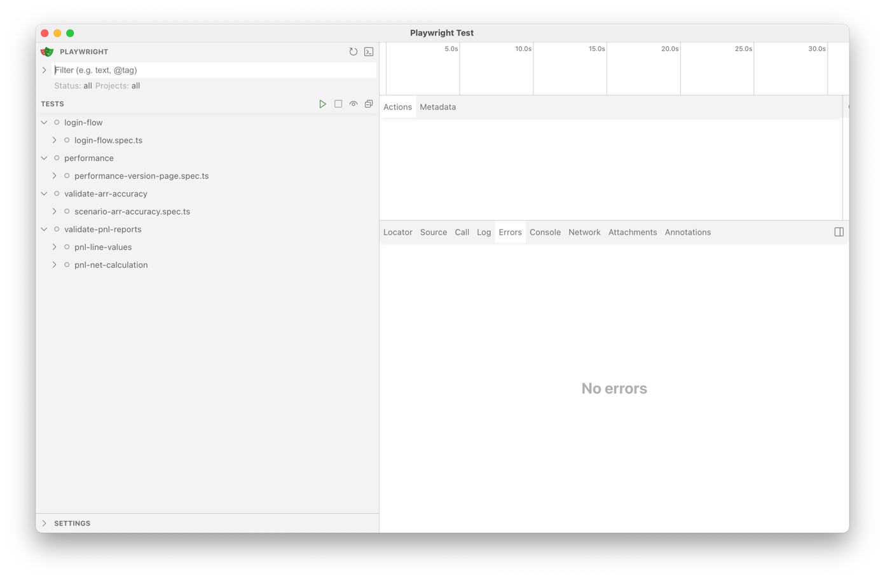
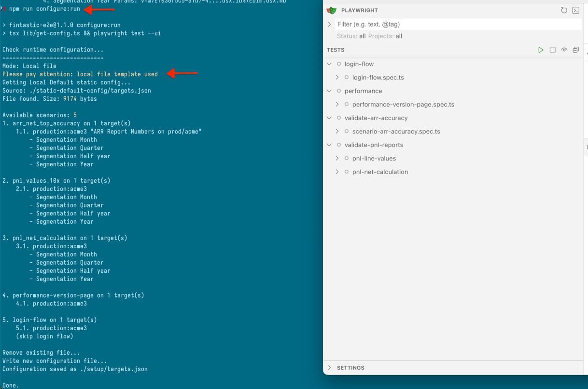
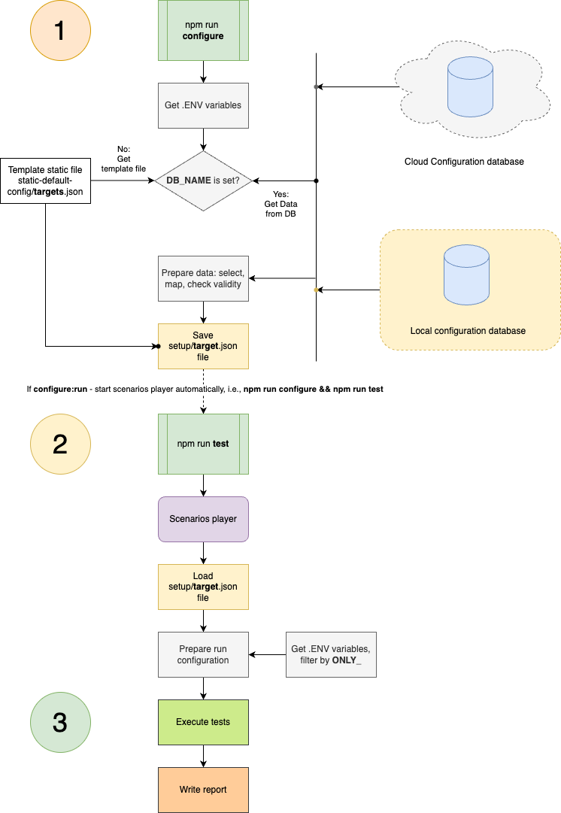

# Fintastic e2e: Run configurations

To configure which tests should be run, there are two (well, three) ways.

## Target Config JSON

Technically, [scenarios player](./scenarios-player.md) uses [configuration](./config-file-format.md)
from `./setup/targets.json`.

To be clear, that is configured in `lib/config-consts.ts`:

```ts
export const setupScenarioTargetsFile = './setup/targets.json'
```

You can just create this file and execute

```shell
npm run test
```

which will open Playwright UI with all the available tests:



## Default local config

Other two ways are running tests through `configure` script:

```shell
npm run configure:run
```

This script will check the run environment and create actual `./setup/targets.json`.

In case `DB_NAME` environment is set (CI/CD or local `.env` file) it will connect to database (read below).

If not, it will copy default template file from `static-default-config/targets.json`
(file name is defined in `lib/config-consts.ts` as `const setupScenarioStaticDefault`):



## Local Database

You need to set up variables in local `.env` file:

```dotenv
DB_NAME=fin-e2e # example
DB_USER=e2e_user
DB_PASSWORD=123456
DB_PORT=
```

and, then, run

```shell
npm run configure:run
```


### Remote database

There is no diff between local and remote DBs. Just declare correct connection params in `.env` file.


## Run diagram



## Stages

### Case: Database

`.env` has at least `DB_NAME` variable configured, [database](./db-config.md) is available.

```shell
npm run configure
```

or 

```shell
npm run configure:run
```

or 
```shell
npm run configure:run:headless
```

* Connect to database.
* Select data (`select ...`, you can find the query in [this section](./db-config.md))
* Prepare [data structure](./config-file-format.md) and check consistency.
* Write config file `./setup/targets.json`

If it was `configure:run*`, it automatically executes 

```shell
npm run test
```

which runs [scenarios player](./scenarios-player.md).

## Case: Local

`.env` does not have `DB_NAME` variable configured.

```shell
npm run configure
```

or

```shell
npm run configure:run
```

or
```shell
npm run configure:run:headless
```

* Open template file `static-default-config/targets.json` and check consistency
* Write config file `./setup/targets.json` (i.e., copy file with checking the structure).

If it was `configure:run*`, it automatically executes

```shell
npm run test
```

which runs [scenarios player](./scenarios-player.md).