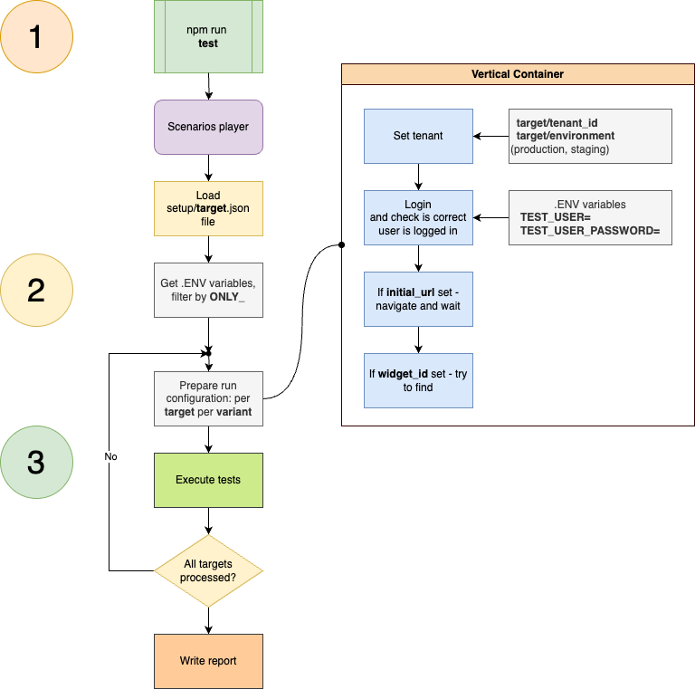
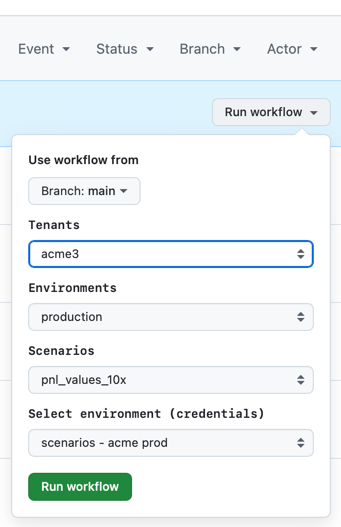

# Fintastic e2e: Scenarios player

Scenarios player is unified runtime which runs the test sequences ("scenarios").

It establishes environment(s) according to current `targets.json` ([read more](config-file-format.md)),
preparing test environments and executes tests.



First, player loads `targets.json`. Then it prepare main test cycle - wrap all the registered
_test executors_ with runtime logic.

## Runtime logic

### Pre-filtering

1.1 First stage of filtering out scenarios, environments and tenants: only scenarios/targets/tenants
listed in [config file](./run-config.md) will be run.

In other words, local/remote database and, as a result, `setup/targets.json`, and real test executors, are
merged together.

If some _scenario_ exists and not included in config - it will be ignored and not executed.

If some _scenario_ code does not exist - configuration check will fail.

1.2. Second stage of filtering by `ONLY_` environment variables, **if any**.

There are only three variables:

* `ONLY_TENANT`, e.g., `ONLY_TENANT=acme3`
* `ONLY_SCENARIO`, e.g., `ONLY_SCENARIO=performance-version-page`
* `ONLY_ENVIRONMENT`, e.g., `ONLY_ENVIRONMENT=staging`

means if `ONLY_SCENARIO=performance-version-page` - despite any database/local config everything except
`performance-version-page` will not be executed.

This is used mostly on CI/CD:



### Preparation of runtime

Then, based on config targets, scenario player will execute each _test executor_ inside
separate Playwright contexts.

It will:

2.1. Set up tenant (`/?tenant-override=...`)

2.2. Login with current credentials (if `skipLogin` is not set to true)

`.env` variables used:

```dotenv
TEST_USER=...
TEST_USER_PASSWORD=...
```

On CI/CD they should be **secrets** in corresponding environment.

2.3. Navigate to `url`/`initial_url` (config/db field name), if declared, and wait. E.g. `board/abcd...`

2.4. Locate specific `widgetId`/`widget_id`, if any.

2.5. Pass current page, navigation function, environment settings and widget to _test executor_.

### Testing

```ts
import { testVersionPerf } from './version-performance-test-executor';
import { scenarioPlayer } from '../../scenarios-player';

scenarioPlayer({
  scenarioId: 'performance-version-page',
  testExecutor: testVersionPerf
});
```

This is generic test scenario. It declares `scenarioId` -

```ts
scenarioId: 'performance-version-page'
```

which should be one of `KnownScenarios` (`types/environment.ts`):

```ts
export const knownScenarios = [
  'arr_net_top_accuracy',
  'pnl_values_10x',
  'pnl_net_calculation',
  'performance-version-page',
  'login-flow'
] as const;

export type KnownScenario = typeof knownScenarios[number];
```

_Test executor_ receives `ScenarioRunContext`:

```ts

export type ScenarioRunContext = {
  page?: Page,
  popup?: Page,
  baseUrl: string,
  tenant: TenantCode // acme3
  domain: DomainType // production
  navigate?: (url: string) => Promise<void>, // without base url, just "board" or "versions"
  widget?: Widget
}

export type PlayerParams = {
  scenarioId: KnownScenario;
  testExecutor: (params: ScenarioRunContext) => void
}
```

This is example of very simple test executor:

```ts
import { expect, test } from '@playwright/test';
import { ScenarioRunContext } from '../../types';
import { Sidebar, VersionsPage } from '../../models';

export function testVersionPerf(params: ScenarioRunContext) {
  test('Loading performance', async () => {

    await params.navigate?.('board'); // should be 404 but ok, doesn't matter

    const sidebar = new Sidebar(params.page!);
    await sidebar.getSidebar();

    const startExec = Date.now();

    await sidebar.versionsButton.click();
    const versionsPage = new VersionsPage(params.page!);
    await versionsPage.waitVersionPageVisibility();

    const endExec = Date.now();

    console.log(`Page visibility time: ${endExec - startExec} ms`);

    expect(endExec - startExec).toBeLessThan(3000); // <-- key check
  });
}
```

This test measures the rendering time of the versions page. It opens the application
on the `Boards` page, waits, then clicks the `Versions`
page button in the sidebar and waits for the page to become visible.

Scenarios player guarantees execution on each configured environment: tenant, target (production, staging),
variant, if any.