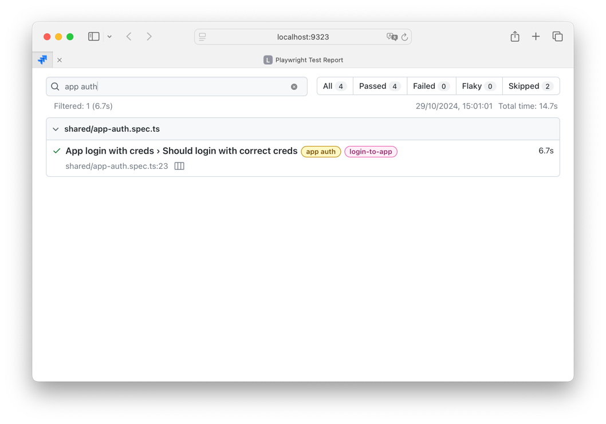

# Fintastic e2e: Scenarios - overview

A test scenario, or test suite, is a more or less isolated e2e test that includes one or more steps to test something.

For example, test scenario for testing ARR numbers description:

---
Goal: validate numbers accuracy

Test 1 - validate waterfall report

* Page - Board with ARR report (**link** to the board, **Id** of the report)
* Time picker set show by=Month
* Single version / multiple versions (**Id** of version / versions)
* Group is set as the first dim in pivot

Validate:

**Net value of every column equals to the start value of next column**

Repeat for show by=Quarter, Half year, Year

---

Implementation includes:

1. Open target URL (site, environment - production, staging, etc.)
2. Setting up Tenant
3. Navigate to target Board
4. Set target parameters (period selection, version(s), etc.)
5. Find target Widget
6. Extract visible data
7. Perform testing
8. Repeat 4-7 for each _variant_.

For steps 1-5 and 8, the [Scenarios Player](./scenarios-player.md) will take care of this.


### Scenario runtime

As you can see, there are some orchestration.

1. Scenario. What exactly should be tested (code).
2. Runtime environments. Where it should test.
    * Target **environment** (production, staging, dev, local...)
    * Target **tenant**
    * Base (**initial**) url, not mandatory because _test executor_ may know better. E.g., for 
   "Versions page performance test" we don't need any initial URL because test will handle
   that by its own: open some non-versions-page, then switch to versions page, measure time etc.
    * **Widget** Id, optional. E.g., ARR or PNL check reports usually need that whereas performance 
   or flow test scenarios - don't need.
    * **Variants** - like the same page, the same widget, other version. Or period selection. Or whatever.
   
So there are nested cycles:
- Per each scenario
  - Per each target env/tenant/base URL
    - Per each variant, if any
      - (execute test) 

### Step 7 - test executor

Typical scenario:

```ts
import { testVersionPerf } from './version-performance-test-executor';
import { scenarioPlayer } from '../../scenarios-player';

scenarioPlayer({
  scenarioId: 'performance-version-page',
  testExecutor: testVersionPerf
});
```

This is generic test scenario. It declares `scenarioId` -

```ts
scenarioId: 'performance-version-page'
```

which should be one of `KnownScenarios` (`types/environment.ts`):

```ts
export const knownScenarios = [
  'arr_net_top_accuracy',
  'pnl_values_10x',
  'pnl_net_calculation',
  'performance-version-page',
  'login-flow'
] as const;

export type KnownScenario = typeof knownScenarios[number];
```

_Test executor_ receives `ScenarioRunContext`:

```ts

export type ScenarioRunContext = {
  page?: Page,
  popup?: Page,
  baseUrl: string,
  tenant: TenantCode // acme3
  domain: DomainType // production
  navigate?: (url: string) => Promise<void>, // without base url, just "board" or "versions"
  widget?: Widget
}

export type PlayerParams = {
  scenarioId: KnownScenario;
  testExecutor: (params: ScenarioRunContext) => void
}
```

This is example of very simple test executor:

```ts
import { expect, test } from '@playwright/test';
import { ScenarioRunContext } from '../../types';
import { Sidebar, VersionsPage } from '../../models';

export function testVersionPerf(params: ScenarioRunContext) {
  test('Loading performance', async () => {

    await params.navigate?.('board'); // should be 404 but ok, doesn't matter

    const sidebar = new Sidebar(params.page!);
    await sidebar.getSidebar();

    const startExec = Date.now();

    await sidebar.versionsButton.click();
    const versionsPage = new VersionsPage(params.page!);
    await versionsPage.waitVersionPageVisibility();

    const endExec = Date.now();

    console.log(`Page visibility time: ${endExec - startExec} ms`);

    expect(endExec - startExec).toBeLessThan(3000); // <-- key check
  });
}
```

This test measures the rendering time of the versions page. It opens the application
on the `Boards` page, waits, then clicks the `Versions`
page button in the sidebar and waits for the page to become visible.

Scenarios player guarantees execution on each configured environment: tenant, target (production, staging),
variant, if any.

#### Tags

You can, and you should, use [tags](https://playwright.dev/docs/test-annotations#tag-tests) in your suites to make
navigation and running the test more simple and manageable:

```ts
test.describe('Login flow', { tag: ['@login', '@login-flow'] }, async () => {
  //...
});
```

Later you can use that, e.g., to filter tests to run:


or filter results:



Scenarios player automatically adds tags - scenario Id, environment, target/variant names:


where the last one, `check`, is for test executor.
